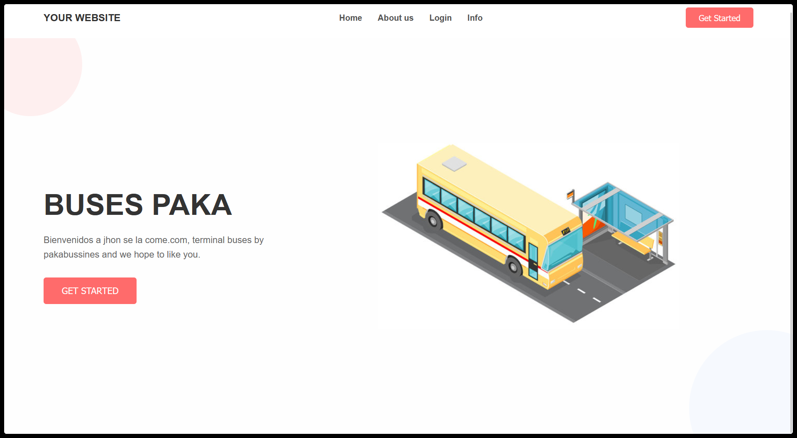

# Ticket Sales System

A web-based application for managing and selling bus ticket reservations. This project uses custom PHP for the backend and plain HTML/CSS/JavaScript for the frontend.

# Main Page



## Features

- User registration and authentication
- View available bus routes and schedules
- Book and cancel tickets
- View user ticket history
- Admin management for routes, schedules, and users

## Project Structure

```
backend/
  api/           # API endpoints (auth, routes, schedules, tickets)
  classes/       # PHP classes (User, Ticket, Bus, etc.)
  config/        # Database configuration
  db/            # Database schema (SQL)
  utils/         # Helper functions
frontend/
  css/           # Stylesheets
  images/        # Images
  js/            # JavaScript files
  form.php       # Registration/Login form
  index.php      # Main frontend entry
index.php        # Main entry point (can route to frontend or backend)
```

## How to Run

1. **Clone the repository:**
    ```bash
    git clone https://github.com/Olhes/ticket_sales_system.git
    cd ticket_sales_system
    ```

2. **Set up the database:**
    - Create a MySQL/MariaDB database
    - Import the schema from `backend/db/database.sql` into your database.
    - Update database credentials in `backend/config/databases.php`.

3. **Run the PHP built-in server:**
    ```bash
    php -S localhost:8000
    ```
    - By default, this will serve files from the project root. Access the app at [http://localhost:8000/frontend/index.php](http://localhost:8000/frontend/index.php)

4. **Access the application:**
    - Open your browser and go to  `http://localhost:8000/` or `http://localhost:8000/frontend/index.php`

## Notes
- No external PHP frameworks are required.
- All backend logic is in the `backend/` directory.
- Frontend assets are in the `frontend/` directory.
